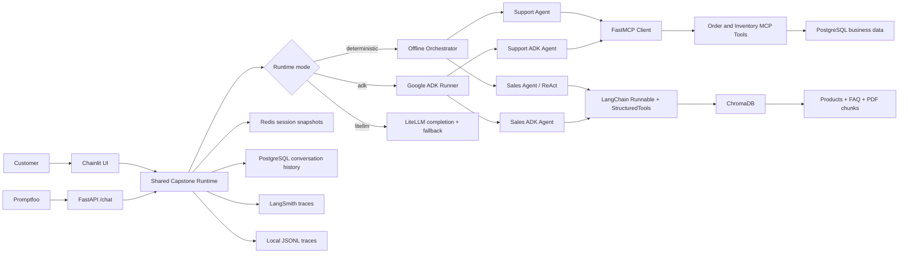

# eComBot Architecture

## Execution Guarantees

- Deterministic mode is offline, grounded, repeatable, and used by CI.
- Live ADK and LiteLLM modes are enabled only when explicitly selected and supplied with model keys.
- Redis and PostgreSQL are strict active backends in Compose; local runs use configured fallbacks.
- Chroma retrieval rejects low-confidence nearest neighbors before agents can use them.
- Promptfoo and Chainlit call the same runtime contract, preventing evaluation-only behavior.
